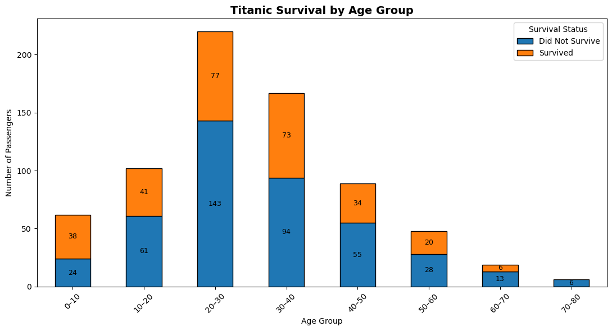

# 🚢 Titanic Survival Analysis

---

## 📌 Project Overview
This project analyzes the Titanic passenger dataset to identify key factors
that influenced survival rates. It focuses on **gender, passenger class, age, and fare**, demonstrating a full **exploratory data analysis (EDA)** workflow — from data cleaning to insight-driven conclusions.  

Created as part of a **data analysis portfolio** to showcase practical Python skills and analytical thinking.

---

## 🎯 Objectives
- Clean and prepare real-world data
- Explore relationships between passenger features and survival
- Communicate insights using clear visualizations
- Produce a reproducible and readable analysis notebook

---

## 📊 Dataset
- Titanic passenger dataset
- Includes demographic, socioeconomic, and survival information
- Widely used for EDA and introductory modeling

---

## 🛠 Tools & Technologies
- **Python 3.9+**
- **Pandas & NumPy**
- **Matplotlib / Seaborn**
- **Jupyter Notebook**
- **Git & GitHub**

---

## 📁 Project Structure

📦 **[da_project](https://github.com/noakazes-svg/da_project)**

📂 **notebooks** – All Jupyter notebooks for analysis  
├─ 📝 [titanic.ipynb](https://github.com/noakazes-svg/da_project/blob/main/notebooks/titanic.ipynb)    
│     Titanic data analysis, EDA, and visualizations  

📂 **assets** – Images, diagrams, and static resources  
├─ 🖼 [preview.png](https://github.com/noakazes-svg/da_project/blob/main/assets/preview.png)    
│     Preview image of data visualization  

📂 **data** – Project datasets  

├─ **Raw datasets**  
│     ├─ [passengers.csv](https://github.com/noakazes-svg/da_project/blob/main/data/raw/passengers.csv)    
│     │     Titanic passengers raw dataset  
│     └─ [fares.csv](https://github.com/noakazes-svg/da_project/blob/main/data/raw/fares.csv)    
│           Raw dataset of passenger fares  

└─ **Processed datasets**  
      └─ [cleaned_data.csv](https://github.com/noakazes-svg/da_project/blob/main/data/processed/cleaned_data.csv)    
            Cleaned and merged dataset ready for analysis  

📂 **scripts** – Python scripts for data processing and utilities  
├─ 🐍 [data_processing.py](https://github.com/noakazes-svg/da_project/blob/main/scripts/data_processing.py)    
│     Functions for cleaning and preparing datasets  
└─ 🐍 [utils.py](https://github.com/noakazes-svg/da_project/blob/main/scripts/utils.py)    
      Helper functions used across notebooks and scripts  

📂 **tests** – Unit tests for scripts  
└─ 🧪 [test_data_processing.py](https://github.com/noakazes-svg/da_project/blob/main/tests/test_data_processing.py)    
      Tests for data_processing.py functions  

📂 **docs** – Project documentation  
└─ 📄 [architecture.md](https://github.com/noakazes-svg/da_project/blob/main/docs/architecture.md)    
      Architecture notes and project overview  

Other files  
├─ 📝 [README.md](https://github.com/noakazes-svg/da_project/blob/main/README.md)    
│     Project description and instructions  
├─ 📄 [requirements.txt](https://github.com/noakazes-svg/da_project/blob/main/requirements.txt)    
│     Python dependencies and packages used  
└─ 🚫 [.gitignore](https://github.com/noakazes-svg/da_project/blob/main/.gitignore)    
      Files and folders ignored by Git  

### 🎨 Legend / Visual Key
- 📂 Folder  
- 📝 Jupyter Notebook  
- 🖼 Image / Diagram  
- 🐍 Python Script  
- 🧪 Test Script  
- 📄 Markdown / Docs  
- 🚫 Ignored Files  
- 🔗 Clickable GitHub links  
- 🏷 Badges indicate file type visually

---

## 🔍 Key Insights
- Women had significantly higher survival rates than men  
- Passengers in higher classes were more likely to survive  
- Younger passengers showed slightly better survival outcomes  
- Fare and passenger class strongly correlate with survival probability

---

## 🚀 How to Run
1. Clone the repository  
2. Open `titanic.ipynb` in Jupyter Notebook  
3. Run the cells from top to bottom  

---

## 🔮 Future Improvements
- Feature engineering for predictive modeling  
- Apply classification models (Logistic Regression, Random Forest)  
- Improve visual storytelling and narrative flow  

---

## 🚀 Next Steps & Project Expansion Ideas
- Build an **interactive dashboard** with Streamlit or Plotly Dash  
- Add **data storytelling** directly in the notebook or README  
- Export the notebook as a **polished PDF report**  
- Include **tips and learnings** to showcase professional depth  
- Enhance **interactivity** with collapsible sections and emojis  
💡 Combining a dashboard with storytelling creates a **portfolio-ready project**

---

## ✍️ Author
**Noa Kazes**  
Aspiring Data Analyst | Python | Data Exploration & Storytelling
